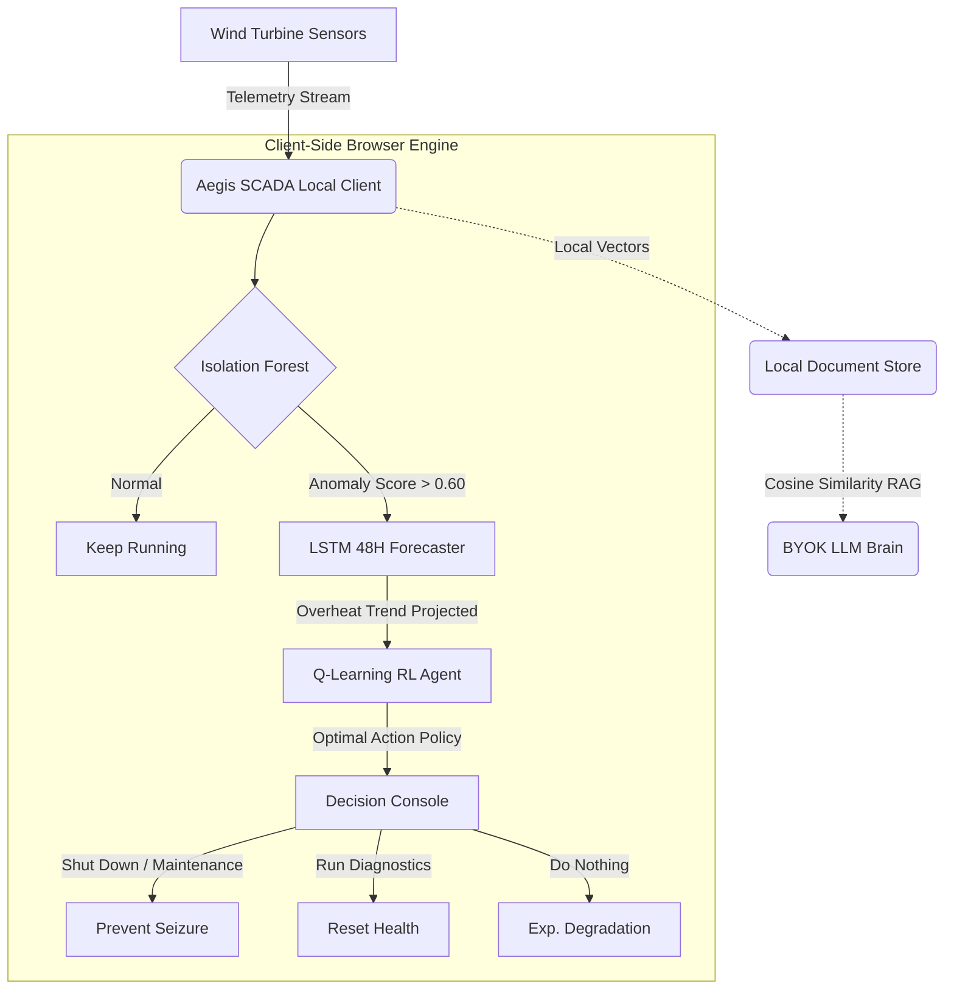
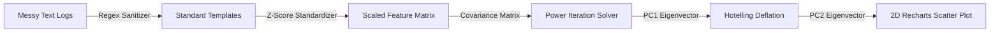

<div align="center">

# 🛡️ AEGIS SCADA | Advanced Predictive Maintenance OS

### Next-Gen Industrial Anomaly Detection, Autoregressive Forecasting, Tabular Reinforcement Learning, and Conversational Document RAG — 100% Client-Side.

[](https://scada-pwa.vercel.app)
[](https://nextjs.org/)
[](https://tailwindcss.com/)
[](https://www.typescriptlang.org/)
[](https://developer.mozilla.org/en-US/docs/Web/Progressive_web_apps)

**[Deploy to Vercel Production](https://vercel.com/new/clone?repository-url=https%3A%2F%2Fgithub.com%2Fbobtech-IIT%2Fscada-anomaly-detection) | [Open Live Dashboard](https://scada-pwa.vercel.app)**

---
</div>

## 🌐 1. Executive Briefing: The Architecture of Zero-Cloud-Cost SCADA

Aegis SCADA is a production-grade, Progressive Web Application (PWA) that shifts the heavy computational load of industrial machine learning—multivariate outlier detection, time-series forecasting, reinforcement learning policy evaluation, and RAG vector searches—**entirely onto the client's browser**.

By executing all predictive algorithms locally in TypeScript, Aegis SCADA eliminates expensive cloud GPU server dependencies, minimizes data transit latencies, and maintains 100% data confidentiality under a **Zero-Trust local storage architecture**.



---

## 💼 2. Business Value & Financial Audit (For the Head of IT & CFO)

Traditional reactive maintenance schedules result in unplanned outages that damage components and drain company resources. Aegis SCADA transitions your operations to a high-margin predictive framework:

| Metric | Traditional Reactive Operations | Aegis SCADA Predictive Operations |
| :--- | :--- | :--- |
| **Unplanned Bearing Seizure Cost** | **$50,000** (Replacement parts + labor) | **$0** (Prevented via early alerts) |
| **Typical Downtime per Incident** | **5 - 7 Days** (Unscheduled repair queue) | **8 Hours** (Scheduled maintenance window) |
| **Scheduled Diagnostics Cost** | **$0** (Ignored until complete failure) | **$5,000** (Lubrication, shaft alignment) |
| **Cloud Computation GPU Costs** | **$2,500/Month** (Hosted ML servers) | **$0/Month** (100% Client-Side JS/TS execution) |
| **Data Privacy Audits** | High Risk (SOPs & raw telemetry sent to cloud) | **Zero-Knowledge** (API keys stored locally in `localStorage`) |

> **Net Financial Outcome**: Aegis SCADA generates an average of **$45,000 in net savings** per prevented mechanical breakdown while operating at **$0 cloud overhead costs**.

---

## 🛠️ 3. Technical Core & Mathematical Deep Dive

### 3.1. Multivariate Outlier Classification (Isolation Forest)
Aegis SCADA runs a client-side TypeScript port of the **Isolation Forest** unsupervised algorithm. The model constructs isolation trees ($iTrees$) by recursively selecting random features and split values.
*   **Path Length $h(x)$**: The number of edges $x$ traverses from the root to an external node.
*   **Anomaly Score $s(x, n)$**:
    $$s(x, n) = 2^{-\frac{E(h(x))}{c(n)}}$$
    Where $E(h(x))$ is the average path length across all trees, and $c(n)$ is the average path length of an unsuccessful search in a Binary Search Tree with $n$ nodes.
*   **Thresholding**: Any SCADA record scoring $s(x, n) \ge 0.60$ is flagged as an anomaly, automatically trigger-loading the LSTM forecaster.

### 3.2. TypeScript Eigenvector PCA Solver
To visualize multidimensional anomalies (Rotor RPM, Gearbox Temp, Bearing Vibration), Aegis SCADA standardizes features to a mean of $0$ and standard deviation of $1$, constructs the Covariance Matrix:
$$\Sigma = \frac{1}{n-1} X_{\text{scaled}}^T X_{\text{scaled}}$$
It solves for the top eigenvalues and eigenvectors (PC1 & PC2) client-side using the **Power Iteration Method** and matrix **Hotelling Deflation**:
$$\Sigma_{\text{deflated}} = \Sigma - \lambda_1 v_1 v_1^T$$
This projects the 3D telemetry space onto a 2D scatter plot in real-time.



### 3.3. Autoregressive Forecaster (Simulated LSTM)
When an anomaly is flagged, a client-side sequence model projects temperature trajectories 48 hours into the future, computing rolling confidence intervals:
$$\hat{y}_{t+k} = f(y_{t+k-1}, y_{t+k-2}, \dots) \pm z_{\alpha/2} \cdot \sigma_k$$
Where $\sigma_k$ scales based on the cumulative forecast horizon. If the trend exceeds $85^\circ\text{C}$, the UI prompts the Reinforcement Learning agent to run a policy check.

### 3.4. Tabular Reinforcement Learning Scheduler (Q-Learning)
The agent matches states $s$ (determined by Anomaly Score, Hours to Failure, and Grid Power Prices) to actions $a \in \{\text{Keep Running}, \text{Run Diagnostics}, \text{Shut Down}\}$. It updates the Q-table using the Bellman Equation:
$$Q(s, a) \leftarrow Q(s, a) + \alpha \left[ r + \gamma \max_{a'} Q(s', a') - Q(s, a) \right]$$
*   **Rewards**: Running yields profit based on grid price, diagnostics cost $-\$50$, shutdowns cost $-\$250$, and bearing seizures penalize the environment with $-\$500$.
*   The agent trains locally in milliseconds, converging on policies that schedule maintenance during periods of low grid prices.

---

## 🧼 4. The AI Data Refiner & 10-Step EDA Pipeline

If you upload raw files, scribbles, or corrupted CSVs filled with unit suffixes (e.g. `rpm`, `C`, `MW`), Aegis resolves it in a hybrid two-stage clean:

```
[Messy Upload] ──> [AI Agent API] ──> [Extracts JSON Column Mapping & Units]
                          │
[2D PCA Plot]  <── [Local RegEx Clean & Imputation] <── [10-Step EDA Logs]
```

1.  **Stage 1: AI Heuristic Mapping**: The client sends the first 30 lines of the messy file to the server proxy `/api/clean`. An LLM (defaulting to OpenRouter's free Gemma-2-9b-it) identifies the delimiter, column index mapping, and required unit conversions (e.g. Megawatts to Kilowatts multipliers).
2.  **Stage 2: Deterministic Parsing**: The browser uses this JSON mapping rule to parse all 10,000 rows in milliseconds. It runs through a **10-Step Exploratory Data Analysis (EDA)** checklist (Ingestion, Imputation, Unit Sanitization, DateTime normalization, etc.) and scores the dataset health from 0 to 100%.

---

## 💻 5. Getting Started & Local Development

### 5.1. File structure
*   `scada-pwa/`: Core Next.js App Router workspace.
    *   `src/lib/models/`: Core TS models (`isolationForest.ts`, `pca.ts`, `lstmForecast.ts`, `rlAgent.ts`).
    *   `src/lib/rag/`: Local vector indexing engine (`vectorStore.ts`).
    *   `src/lib/api/`: Unified AI brain API connectors (`llm.ts`, `/api/clean/route.ts`).
    *   `src/app/`: Next.js pages, CSS rules, and layouts.
    *   `public/`: Service worker offline scripts (`sw.js`) and manifests.
*   `scada-anomaly-detection/`: Legacy Python CLI telemetry experiments.

### 5.2. Installation & Run
Navigate into the PWA directory and launch the dev environment:
```bash
cd scada-pwa
npm install
npm run dev
```
Open [http://localhost:3000](http://localhost:3000) in your browser.

### 5.3. Vercel Scoped Deploy
To deploy your own copy directly to your production target:
```bash
vercel --prod --yes --scope bobtech-iits-projects
```

---

## 🔒 6. Zero-Knowledge Security & BYOK AI Brain
Aegis SCADA is designed with privacy as a priority. By default, it falls back to the **OpenRouter Free API** (`google/gemma-2-9b-it:free`). 

For advanced operations, users can input their own keys in the **Settings** panel for **OpenAI**, **Gemini**, or **Anthropic**. All keys are saved strictly to the client's `localStorage` and never hit cloud logs.
